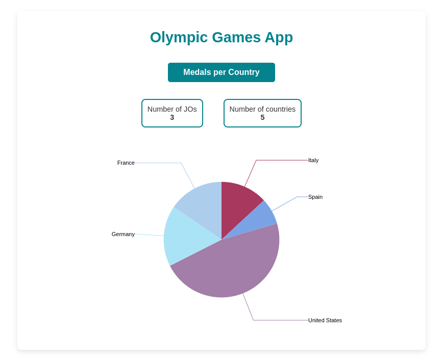

# Olympic Games App

Interface to display historical results of the Olympic Games

## Overview



## Features

- View historical data of Olympic Games results in chart form.

## Installation

Clone this repository :

```
git clone https://github.com/leaandredev/P2-Telesport.git
```

Go in your project directory and install your node_modules before starting :

```
npm install
```

### Dev mode

Run the server in development mode :

```
ng serve
```

Navigate to `http://localhost:4200/`. The application will automatically reload if you change any of the source files.

### Build

Run `ng build` to build the project. The build artifacts will be stored in the `dist/` directory.

## Usage

The home page displays Olympic data for all countries, including:

- Total number of Olympic Games
- Total number of participating countries
- A pie chart showing the total number of medals per country

Click on any item in the pie chart to access the details page, which shows:

- Number of entries
- Total number of medals
- Total number of athletes
- A line chart displaying the number of medals per year

## Technologies

**Angular** - Main framework

**TypeScript** - Programming language

**SCSS** - Styling for the UI design

**ngx-charts** - Charting library

## Contributing

Olympic Games App is an open source project. Feel free to fork the source and contribute with your own features.

## Authors

- Lea ANDRE

## Licensing

This project was built under the Creative Commons licence.
